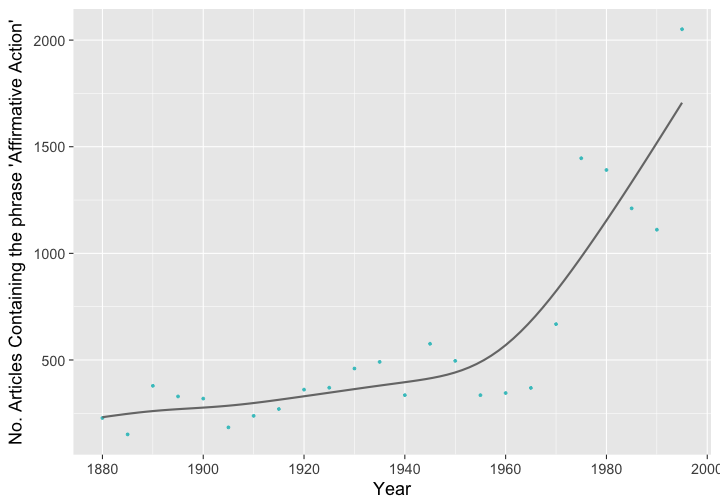

<!--
%\VignetteEngine{knitr::knitr}
%\VignetteIndexEntry{NYTimes Civil Rights}
%\VignetteEncoding{UTF-8}
-->


Use case - Civil Rights Coverage in NYT over time
=================================================

This is an example use of `rtimes` from [Gaurav Soodoku](http://gbytes.gsood.com/). Find the original code [at GitHub](https://github.com/soodoku/nyt-civil-rights).

This example is a smaller subset of the analysis in the original code, just looking at one phrase: _Affirmative Action_

## Installation


```r
install.packages("rtimes")
```


```r
library("rtimes")
```

## Authentication

First, get an API key for the Article Search API at [developer.nytimes.com/apps/register](http://developer.nytimes.com/apps/register). Then set the key in R:


```r
Sys.setenv(NYTIMES_AS_KEY = '<your api key>')
```

## Query the NYTimes Article Search API

Set dates. Here, one query per year from 1881 to 1985


```r
dates <- format(seq(as.Date("1880/1/1"), as.Date("2000/1/1"), by = "5 years"), "%Y%m%d")
```

Make a data.frame to put data in to


```r
results <- data.frame(startDate = NA, endDate = NA, afam = NA)
```

Loop through dates


```r
for (i in seq_len(length(dates) - 1)) {
  Sys.sleep(1)
  counts <- NA
  counts <- as_search(q = "affirmative action",
                      begin_date = dates[i],
                      end_date = dates[i + 1])$meta$hits[1]
  results[i, ] <- c(dates[i], dates[i + 1], counts)
}
```

## Plot results

Load packages


```r
library("lubridate")
library("ggplot2")
library("scales")
library("grid")
```

Convert dates to class `date`


```r
results$startDate <- as.Date(as.character(results$startDate), format = "%Y%m%d")
results$afam <- as.numeric(results$afam)
```

Plot mentions of _Affirmative Action_


```r
ggplot(results, aes(x = startDate, y = afam)) +
  geom_point(size = 1, color = "#42C4C7") +
  geom_smooth(method = "gam", formula = y ~ s(x), aes(group = 1),
              size = 1, colour = "#777777", alpha = 0.05, se = FALSE) +
  ylab("No. Articles Containing the phrase 'Affirmative Action'") +
  xlab("Year") +
  scale_x_date(breaks = pretty_breaks(n = 10)) +
  theme_grey(base_size = 18)
```


