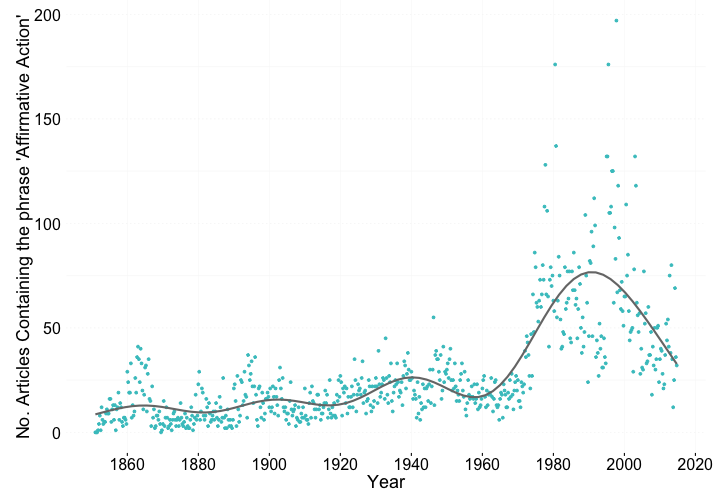

<!--
%\VignetteEngine{knitr::knitr}
%\VignetteIndexEntry{NYTimes Civil Rights}
%\VignetteEncoding{UTF-8}
-->


Use case - Civil Rights Coverage in NYT over time
=================================================

This is an example use of `rtimes` from [Gaurav Soodoku](http://gbytes.gsood.com/). Find the original code [at GitHub](https://github.com/soodoku/nyt-civil-rights). 

This example is a smaller subset of the analysis in the original code, just looking at one phrase: _Affirmative Action_

## Installation


```r
install.packages("devtools")
devtools::install_github("ropengov/rtimes")
```


```r
library("rtimes")
```

## Authentication

First, get an API key for the Article Search API at [developer.nytimes.com/apps/register](http://developer.nytimes.com/apps/register). Then set the key in R:


```r
options(nytimes_as_key = '<your api key>')
```

## Query the NYTimes Article Search API

Set dates


```r
dates <- format(seq(as.Date("1851/1/1"), as.Date("2015/1/1"), by = "3 months"), "%Y%m%d")
```

Make a data.frame to put data in to


```r
results <- data.frame(startDate=NA, endDate=NA, afam=NA)
```

Loop through dates


```r
for (i in 1:(length(dates) - 1)) {
  counts <- NA
  counts <- as_search(q = "affirmative action", 
                      begin_date = dates[i], 
                      end_date = dates[i + 1])$meta[1]
  results[i, ] <- c(dates[i], dates[i + 1], counts)
}
```

## Plot results

Load packages


```r
library("lubridate")
library("ggplot2")
library("scales")
library("grid")
```

Convert dates to class `date`


```r
results$startDate <- as.Date(as.character(results$startDate), format = "%Y%m%d")
```

Plot mentions of _Affirmative Action_


```r
ggplot(results, aes(x = startDate, y = cr)) +
  geom_point(width = 1, color = "#42C4C7") +
  geom_smooth(method = "gam", formula = y ~ s(x), aes(group = 1), 
              size = 1, colour = "#777777", alpha = 0.05, se = FALSE) +
  ylab("No. Articles Containing the phrase 'Affirmative Action'") +
  xlab("Year") +
  theme_bw() +
  scale_x_date(breaks = pretty_breaks(n = 10)) + 
  theme(panel.grid.major.y = element_line(colour = "#e3e3e3", linetype = "dotted"),
        panel.grid.minor.x = element_blank(),
        panel.grid.major.x = element_line(colour = "#f7f7f7", linetype = "solid"),
        panel.border       = element_blank(),
        legend.position  = "bottom",
        legend.key       = element_blank(),
        legend.key.width = unit(1,"cm"),
        axis.title   = element_text(size = 18),
        axis.text    = element_text(size = 16),
        axis.ticks.y = element_blank(),
        axis.line.x  = element_line(colour = 'red', size = 3, linetype = 'dashed'),
        axis.title.x = element_text(vjust = -1),
        axis.title.y = element_text(vjust = 1),
        plot.margin = unit(c(0,.5,.5,.5), "cm"))
```

 
